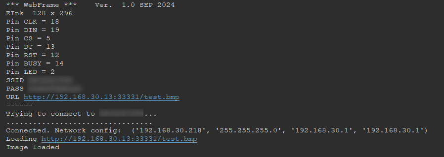
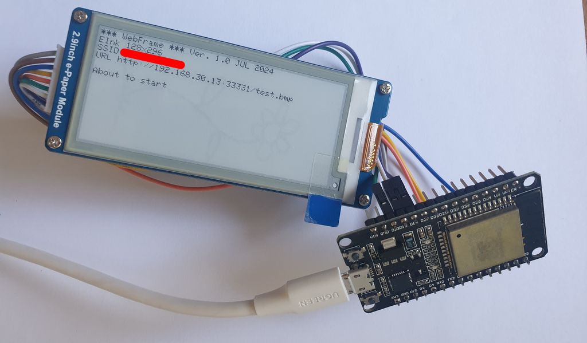
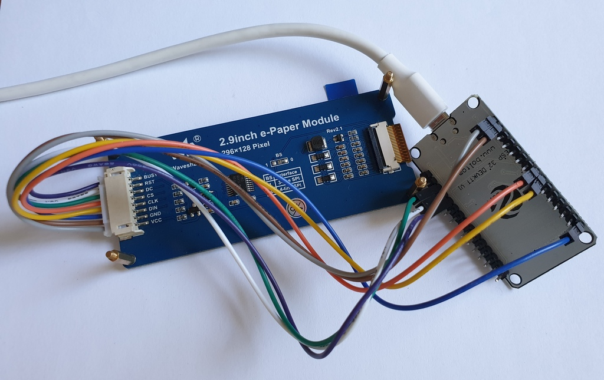
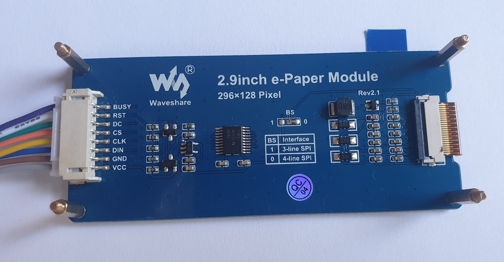

# ESP32 E-INK frame
#### Draw an image from the internernet on a e-paper module

[ESP32 development board](https://www.adafruit.com/product/3269)

[2.9inch E-Ink display module](https://www.waveshare.com/2.9inch-e-paper-module.htm)

How to [flash the board](https://docs.micropython.org/en/latest/esp32/tutorial/intro.html)

Tested on the [MicroPython v1.32.0](https://micropython.org/resources/firmware/ESP32_GENERIC-20240602-v1.23.0.bin)

The [Thonny](https://thonny.org/) editor is recommended for uploading scripts.

---

The [script](board/) displays an image sourced from the internet, updating every 15 minutes.

    
Please update **AP_SSID**, **AP_PASS**, and **URL** variables in the [appconfig.py](board/appconfig.py) before uploading.

The script expects the **URL** variable to point to the [**1-bit Windows bitmap image 128x296 pixels in portrait orientation**](pic/test.bmp).

